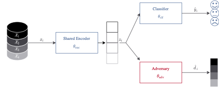

# ACSE Framework
ACSE (Adversarial Censored Shared Encoder) Framework is a Framework for learning from multiple data-sources. Thereby the concept of adversarial inference is used where a data-source ID d, i.e. the id of the data-source a sample is drawn from, is used as nuisance variable.

## Description
The ACSE Framework consists of one encoder, one classifier, and one adversary. The data of each data-source are processed by the encoder and then passed to the classifier and the encoder. The better the adversary can reconstruct the data-source ID from the latent representation, the more the encoder gets penalized. This should lead the encoder to learning domain-invariant representations of the data A visualization of the Framework is shown in the following picture 
  
In Addition in the folder `preprocessing` this repository includes notebook for preprocessing the four well known EEG datasets SEED, SEED-IV, DEAP and DREAMER

## How to use it
In order to train the Framework, you can use the method `pipeline` in the file `model/pipeline.py` to train and test an ACSE Framework. For more information on the parameters you need to pass to the method, please refer to the comments in the file.